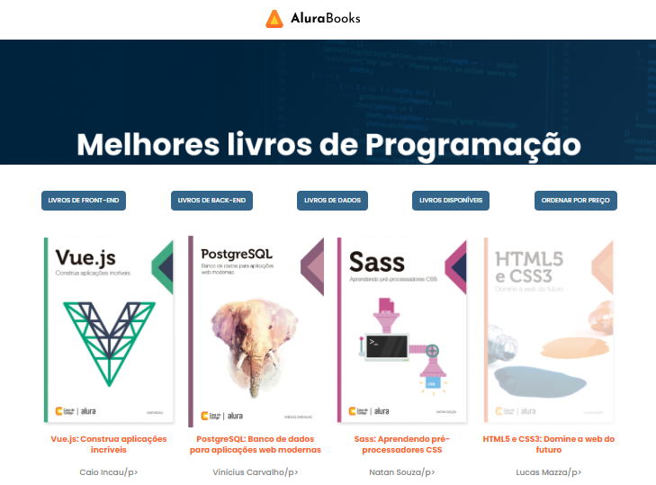

# Alura Books:

 Projeto feito com objetivo de aprimorar técnica de CSS, HTML, JAVASCRIPT, promovido pela ALURA em parceria com a ONE - ORACLE.

 ## O projeto:

    É um site de e-commerce com exemplo de livro de programação.

## Funcionalidades:

   - Utilização de filtros de acordo com a pesquisa realizada pelo usuário;
   - Utilização da API para inserção dos livros;

   